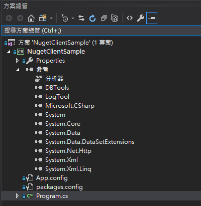

# Demo-版控

一般大型程式，通常會引用多個外部元件，例如以下範例程式，參考了DBTools.dll、LogTool.dll

常見問題1：此類專案/程式，在進行版控時，有時會發生主程式從版控Repository clone下來，建置時發現缺少參考問題。需要手動把dll檔重新加入參考或寫bat自動搬dll至專案

常見問題2：當參考的dll檔更新版本時，不易控管。開發人員需要手動更新dll檔

## 搭配Nuget做法

專案若有使用Nuget管理外部dll、元件時，從程式碼Repository clone下來的程式碼可能如下：

其中packages.config檔將定義該專案所參考的Nuget套件

第一次專案開啟後，會出現參考遺失的警告

重新建置專案後，Visual Studio會依照packages.config中設定去Nuget Server抓取對應套件、版本並安裝至專案中。

註：該電腦的Visual Studio中Nuget套件來源設定中需要能找到該套件才行，因此如果Nuget套件來源是私有的Nuget Server，記得要先加入可用套件來源中\(工具→Nuget套件管理員→套件管理員設定\)

當Nuget套件更新版本時，Nuget解決方案頁面亦會出現更新項目

點選安裝即可完成更版。

此版控程式，搭配CI/CD \(Jenkins等DevOps工具\)可有效管理/更新dll檔使用及避免用錯版本問題

